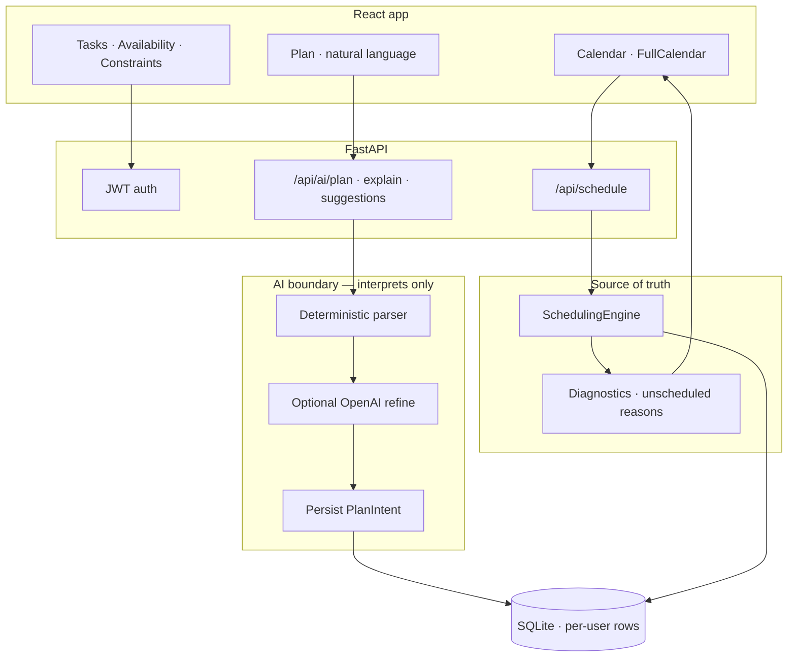

# Chronos

**AI interprets your week. A constraint engine places the blocks.**

Chronos turns natural-language planning into a conflict-free calendar — then explains anything that cannot fit. The parser (and optional LLM) only interprets intent; a verified scheduling engine remains the **source of truth**.

[](./backend)
[](./TECHNICAL.md)
[](./LICENSE)

---

## The plan (what we built)

Chronos started as a class constraint scheduler. This release turns it into a full AI-native planner:

1. **Natural language → structured intent** — deterministic parser (always on) plus optional OpenAI refine  
2. **Multi-spot requests** — e.g. “find me 3 spots, each 2 hours” becomes three contiguous blocks  
3. **SchedulingEngine as authority** — hard constraints never silently invent capacity  
4. **Diagnostics** — clear reasons when work stays unscheduled  
5. **Interactive calendar** — FullCalendar week view with drag, resize, and create  
6. **Multi-user auth** — JWT accounts; each user owns tasks, availability, constraints, and blocks  
7. **CST/CDT time rules** — past starts rejected with a clear America/Chicago message  
8. **Ship path** — Docker Compose, CI on `master`/`main`, seeded demo account  



Deep dive: **[TECHNICAL.md](./TECHNICAL.md)** · more docs in [`docs/`](./docs/)

---

## Why Chronos

Most “AI calendars” invent a plan and hope. Chronos separates concerns:

| Layer | Responsibility |
|--------|----------------|
| **AI planner** | Parse plain English into tasks, availability, and constraints |
| **Scheduling engine** | Place blocks under hard constraints — no overlap, no fantasy capacity |
| **Diagnostics** | Tell you *why* something stayed unscheduled |

**Hard constraints:** availability windows, protected blocks, deadlines, earliest start, max continuous work, no overlap.  
**Soft preference:** morning / afternoon / evening influences scoring — never silently drops a task.

---

## Product surface

| View | What it does |
|------|----------------|
| **Plan** | Natural-language composer (works with **zero** API keys) |
| **Calendar** | Week grid — drag, resize, select-to-create, `.ics` export |
| **Tasks / Availability / Constraints** | Precise controls when you want them |
| **Auth** | Register / login; JWT multi-user isolation |

---

## Quick start

### Demo account

Seeded on first API startup when no users exist:

| | |
|--|--|
| **Email** | `demo@chronos.app` |
| **Password** | `chronos-demo` |

### Backend

```bash
cd backend
python3 -m venv .venv
source .venv/bin/activate          # Windows: .venv\Scripts\activate
pip install -r requirements.txt
uvicorn app.main:app --reload --host 127.0.0.1 --port 8000
```

- API → http://127.0.0.1:8000  
- OpenAPI → http://127.0.0.1:8000/docs  

### Frontend

```bash
cd frontend
npm install
npm run dev -- --host 127.0.0.1 --port 5173
```

- App → http://127.0.0.1:5173  
- Vite proxies `/api` → `http://127.0.0.1:8000`

### Docker

```bash
cp .env.example .env
docker compose up --build
```

- Web → http://localhost  
- API → http://localhost:8000  

Optional: set `OPENAI_API_KEY` in `.env` to refine NL parsing. The deterministic parser always works without it.

---

## Try these prompts

No API key required:

```text
Find me 3 spots, each 2 hours long for deep work
Schedule 4 blocks of 90 minutes for studying
give me 3 two-hour sessions
Schedule 3 hours of deep work on the Chronos resume tomorrow morning, high priority
Protect lunch every day from 12 to 1
I'm free weekdays 9am to 5pm
Block 90 minutes to study algorithms before Friday, can split
I have a test for STAT 410 on Thursday at 5–6:30. Block out per day to study for this
```

---

## Stack

| Area | Tech |
|------|------|
| Frontend | React 18, TypeScript, Vite, FullCalendar, React Router |
| Backend | FastAPI, SQLModel, SQLite, JWT + bcrypt |
| AI | Deterministic planner + optional OpenAI refine |
| Engine | Scored greedy allocation, coalesced blocks, diagnostics |
| Time | America/Chicago (CST/CDT) for “already passed” rules |
| Ops | Docker Compose, GitHub Actions (`master` / `main`) |

---

## Tests

```bash
cd backend && pytest -q
cd frontend && npm test -- --run && npm run build
```

Backend suite: **88** tests (planner, constraints, schedule moves, CST, AI multi-spot).

---

## Team

Built by **Aarav Mittal**, Josh Olmos, Anjay Krishna, and Ojas Bankhele.

## License

MIT — see [LICENSE](./LICENSE).
