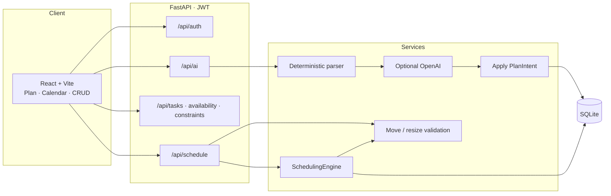
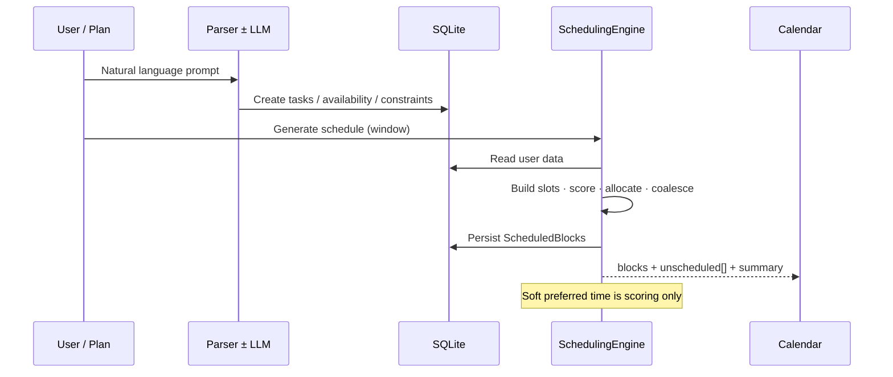

# Chronos — Technical Overview

This document explains the architecture, the AI ↔ engine boundary, and the major systems shipped in this release.

---

## System architecture



| Piece | Path | Role |
|-------|------|------|
| UI shell | `frontend/src/components/layout/` | Sidebar, top bar, right rail |
| Plan | `frontend/src/components/plan/` | NL composer + example chips |
| Calendar | `frontend/src/components/calendar/` | FullCalendar drag / resize / create |
| Auth | `backend/app/api/auth.py` | Register, login, `/me` |
| AI routes | `backend/app/api/ai.py` | Plan, explain, suggestions |
| Parser | `backend/app/services/ai/parser.py` | Always-on heuristics (incl. multi-spot) |
| LLM | `backend/app/services/ai/llm.py` | Optional JSON refine |
| Engine | `backend/app/services/scheduler/` | Placement + diagnostics |
| Time | `backend/app/core/timeutil.py` | America/Chicago helpers |

---

## Design thesis

```text
Natural language
      │
      ▼
 AI planner (deterministic ± optional OpenAI)
      │   ← interprets intent only
      ▼
 Tasks · Availability · Constraints  (DB)
      │
      ▼
 SchedulingEngine + diagnostics     ← source of truth
      │
      ▼
 Calendar · explain panel · .ics
```

The model **never** writes calendar blocks directly. It produces a `PlanIntent`; `apply.py` persists rows; the engine places them.

---

## Auth

- Register / login issue HS256 JWTs (`python-jose`).
- Passwords hashed with `passlib[bcrypt]` (`bcrypt==4.0.1`).
- `Authorization: Bearer <token>` required on resource routes.
- Models (`Task`, `AvailabilityWindow`, `Constraint`, `ScheduledBlock`) carry `user_id`.
- Demo seed: `demo@chronos.app` / `chronos-demo` when the users table is empty.

Config (`app/core/config.py`): `SECRET_KEY`, `ACCESS_TOKEN_EXPIRE_MINUTES`, `OPENAI_API_KEY`, `DATABASE_URL`, `CORS_ORIGINS`.

---

## AI boundary

| Module | Role |
|--------|------|
| `services/ai/parser.py` | Deterministic regex/heuristics — **always on** |
| `services/ai/llm.py` | Optional OpenAI JSON refine if `OPENAI_API_KEY` set |
| `services/ai/apply.py` | Persist `PlanIntent` rows for the current user |
| `services/ai/planner.py` | Orchestration + assistant message + suggestions |
| `SchedulingEngine` | **Source of truth** for placement and diagnostics |

### Multi-spot parsing

Prompts like “find me 3 spots, each 2 hours” or “give me 3 two-hour sessions” expand into **N non-splittable tasks** of equal duration (spread across weekdays so the engine can place distinct blocks).

### AI endpoints

- `POST /api/ai/plan` — `{ prompt, start_date, end_date, apply }` → intent, created entities, schedule, `assistant_message`
- `POST /api/ai/explain` — read-only diagnostics for current tasks vs schedule
- `GET /api/ai/suggestions` — rule-based tips

---

## Scheduling engine



Greedy scored allocation (`allocator.py` + `scoring.py`) over availability slots with protected-time carving. Contiguous fragments coalesce into real blocks.

### Generate response shape

```json
{
  "blocks": [...],
  "unscheduled": [{ "task_id", "task_name", "reason", "detail" }],
  "summary": "..."
}
```

### Diagnostic reasons

| Reason | Meaning |
|--------|---------|
| `no_availability` | No windows / no slots (no 24/7 invent-on-generate) |
| `deadline_impossible` | Cannot finish before deadline |
| `earliest_start_blocks` | Earliest start leaves no room |
| `preference_mismatch` | Informational; preference is soft |
| `max_continuous_truncation` | Hit max continuous work |
| `no_capacity` | Week is full under constraints |

### Move / resize

- Validate **only the moved/resized block** (not the whole history).
- Times are treated as **local / America/Chicago**, not UTC-shifted wall clocks.
- Starts in the past → rejected: *“That time has already passed — try a time in the future (CST).”*
- Empty accounts: weekday availability can be auto-seeded (8am–10pm) so first generate works.

---

## API surface (authenticated)

- `POST /api/auth/register`, `POST /api/auth/login`, `GET /api/auth/me`
- CRUD `/api/tasks`, `/api/availability`, `/api/constraints`
- `GET/POST /api/schedule`, `POST /api/schedule/blocks`, `PATCH/DELETE /api/schedule/blocks/{id}`, `POST /api/schedule/export`
- AI routes above

---

## Frontend

- React + Vite + TypeScript, `react-router-dom` (`/login`, `/app`)
- Reclaim-style shell: dark sidebar, top bar, planner center, right rail
- Plan view: NL composer + multi-spot example chips
- Calendar: FullCalendar `timeGridWeek` + drag / resize / select-to-create
- JWT in `localStorage` via axios interceptor
- Typography: IBM Plex Sans; local datetime helpers in `utils/dates.ts`

---

## Ops

- `docker-compose.yml` — API + nginx frontend
- GitHub Actions CI on `master` and `main`
- Backend: `pytest` (~88 tests)
- Frontend: Vitest + production `npm run build`

---

## Style note

Backend intentionally uses camelCase identifiers in places; Ruff naming rules `N802/N803/N806` are ignored.
